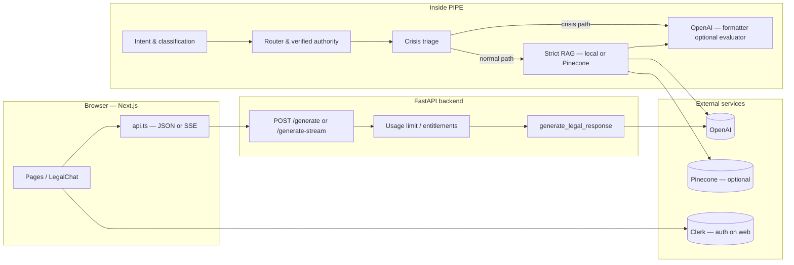

# NyayaSetu

## About the project

**NyayaSetu** (“nyaya” ≈ justice, “setu” ≈ bridge) is a **legal AI assistant** platform: users can upload legal materials, get structured explanations and next steps, and chat in a **safety-aware** pipeline designed for **India-relevant** context—authorities, land and emergency signals, and **English + Hindi** (including Romanized Hindi) in the UI and API.

**What it does**

- **Document intelligence** — Ingest PDFs and images, optional **OCR** (including difficult scans / empty-text PDFs where configured), extract text, and ground answers with configurable **RAG** (local or Pinecone).
- **Conversational legal help** — Streamed and non-streamed generation, routing through **multi-agent** logic, **crisis / emergency** triage, **authority** and domain checks, and eval hooks (see e.g. golden routing tests in CI).
- **Product features** — **Clerk** authentication, **Stripe** subscriptions and entitlements, usage limits, **offline** / retry queue on the web client, and a **lawyer-style dashboard** (in progress) for saved cases.
- **Operations** — FastAPI service, Next.js PWA-style shell, **pytest**-heavy backend, and **AWS** (App Runner, ECR, CloudFront) with **GitHub Actions** for build and optional Terraform lifecycle.

**What to expect**

- This is **decision support and drafting help**, not a law firm. Users should **verify** outcomes with a qualified professional for matters that require it.  
- The codebase is an active product: see [docs/ROADMAP_TRACKER.md](docs/ROADMAP_TRACKER.md) for phase status and [docs/DEPLOYMENT_AWS.md](docs/DEPLOYMENT_AWS.md) for how it is run in the cloud.

---

## Repository layout

| Area | Path | Tech |
|------|------|------|
| **Web** | [`frontend/`](frontend/) | Next.js 16, React 19, TypeScript, Tailwind, Clerk |
| **API** | [`backend/`](backend/) | Python 3.11, FastAPI, pytest |
| **Infra (AWS)** | [`infra/`](infra/) | Terraform (App Runner, ECR, CloudFront, IAM, optional S3 state) |
| **Docs** | [`docs/`](docs/) | Deployment, environment, roadmaps, specs |
| **Scripts** | [`scripts/`](scripts/) | Deploy, destroy, S3 state bootstrap, checks |

### Directory structure (overview)

```text
NyayaSetu/
├── .github/workflows/          # CI, deploy to AWS (ECR → App Runner), Terraform destroy, routing goldens, optional Pinecone jobs
├── backend/
│   ├── app/
│   │   ├── api/v1/             # FastAPI routes: generate, generate-stream, ingest-document, billing, feedback, …
│   │   ├── ai/                 # RAG pipeline, embeddings, legal reasoning, draft evaluator, LLM helpers
│   │   ├── services/          # Core orchestration (ai_service), crisis triage, authority, usage limits, OCR
│   │   ├── rag/               # Legal KB, Pinecone index, ingest jobs, policy
│   │   ├── core/              # Classifier, jurisdiction graph, authority data
│   │   └── research/case_law/ # Optional lawyer-mode case-law adapters
│   ├── tests/                 # pytest suite (routing goldens, RAG, triage, …)
│   ├── Dockerfile
│   └── requirements.txt
├── frontend/
│   ├── app/                   # Next.js App Router (chat, marketing, blog, localized routes)
│   ├── components/            # LegalChat, FormattedLetter, marketing UI
│   ├── lib/                   # API client, parsing, offline queue
│   ├── Dockerfile
│   └── package.json
├── infra/terraform/nyayasetu/ # ECR, App Runner, IAM (OIDC), CloudFront, Route 53 / ACM (optional)
├── docs/                      # Deployment, architecture, personas, runbooks
├── scripts/                   # Secret checks, Terraform bootstrap, deploy helpers
├── docker-compose.yml         # Local API + web
└── README.md
```

**Deep-dives:** [infra/README.md](infra/README.md) (AWS & Terraform) · [docs/DEPLOYMENT_AWS.md](docs/DEPLOYMENT_AWS.md) (phased checklist) · [docs/USER_REQUEST_FLOW.md](docs/USER_REQUEST_FLOW.md) (step-by-step request path) · [docs/TECHNICAL_ARCHITECTURE.md](docs/TECHNICAL_ARCHITECTURE.md) (LLM, RAG, guardrails, CI)

**Environment variables:** [docs/ENVIRONMENT.md](docs/ENVIRONMENT.md) — copy from `backend/.env.example` and `frontend/.env.example` (do not commit real `.env` files).

---

## Data flow

At a glance: the **browser** calls the **FastAPI** service (`/generate` or SSE `/generate-stream`). The backend runs **classification → routing → authority → crisis/RAG → LLM formatter** (optional evaluator/refiner), then returns **document**, **explanation**, **next_steps**, and metadata to the UI.



- **Optional:** `POST /ingest-document` extracts text (and optional OCR); extracted text feeds the **next** chat message to `/generate`.  
- **Production:** images are built in CI and run on **AWS App Runner** (API + web); see [infra/README.md](infra/README.md).

---

## Peer review & demo criteria map

This section aligns the repository with a typical **capstone / squad demo review** rubric (technical depth, engineering practices, production readiness, presentation). Use it to find **evidence in-repo** and to see **what is not fully covered** (explicit gaps).

### Section 1 — Technical depth (~20%)

| Criterion | Where to find evidence in this repo |
|-------------|--------------------------------------|
| **Problem selection & scope** | [README § About](#about-the-project) — India-focused legal assistance, safety-aware routing; [docs/USER_PERSONAS.md](docs/USER_PERSONAS.md), [docs/CORPUS_V1_BOUNDARY.md](docs/CORPUS_V1_BOUNDARY.md), [docs/USER_REQUEST_FLOW.md](docs/USER_REQUEST_FLOW.md) (constraints: educational, not a law firm). |
| **Architecture & design** | [docs/TECHNICAL_ARCHITECTURE.md](docs/TECHNICAL_ARCHITECTURE.md) — components, AWS diagram, RAG vs crisis paths; [docs/USER_REQUEST_FLOW.md](docs/USER_REQUEST_FLOW.md) (Mermaid); directory tree [above](#directory-structure-overview). |
| **Prompt & model interaction** | [docs/TECHNICAL_ARCHITECTURE.md](docs/TECHNICAL_ARCHITECTURE.md) §7 — formatter JSON contract, temperatures, structured outputs; implementation in `backend/app/services/ai_service.py` (`FORMATTER_SYSTEM_PROMPT`, `_run_formatter`), `backend/app/ai/draft_evaluator_agent.py`. |
| **Orchestration & control flow** | `backend/app/services/ai_service.py` (`generate_legal_response`), `backend/app/services/crisis_triage.py`, `backend/app/services/clarification_agent.py`, `backend/app/ai/rag_pipeline.py` — branching (crisis vs RAG), clarifications, fallbacks. |

**Gaps / not claimed here:** trade-off memos are partly implicit (see roadmap); no separate ADR folder. Few-shot examples in prompts are not summarized in a single “prompt catalog” document.

### Section 2 — Engineering practices (~20%)

| Criterion | Where to find evidence |
|-----------|-------------------------|
| **Code quality** | Split **FastAPI** (`backend/app/api/`), **services**, **ai/**, **rag/**; **Next.js** app router + components; consistent typing in frontend. |
| **Logging & error handling** | Structured RAG logs (`backend/app/ai/rag_pipeline.py` — query hash, no raw PII); HTTP error codes in `backend/app/api/v1/generate.py`; defensive try/except on optional paths (e.g. evaluator). |
| **Unit / integration tests** | `backend/tests/` — routing, RAG, triage, clarification, ingest; [backend/docs/GOLDEN_ROUTING.md](backend/docs/GOLDEN_ROUTING.md); CI runs pytest + frontend typecheck + lint + build ([.github/workflows/ci.yml](.github/workflows/ci.yml)). |
| **Observability** | Structured retrieval logs; rate-limit headers (`usage_limit.py`). **Not in repo:** APM traces, centralized log aggregation, token-usage dashboards, or alerting playbooks. |

### Section 3 — Production readiness (~15%)

| Criterion | Where to find evidence |
|-----------|-------------------------|
| **Solution feasibility** | Deployed path **ECR → App Runner**; configurable RAG (`local` / Pinecone); billing modes documented ([backend/docs/STRIPE.md](backend/docs/STRIPE.md)); disclaimers in API/i18n. |
| **Evaluation strategy** | Regression-style tests + **routing golden** weekly workflow; optional **draft evaluator/refiner** (`EVALUATOR_DUAL_DRAFT`). **Gaps:** no documented LLM-as-judge suite, human rating pipeline, or frozen quality baselines beyond pytest goldens. |
| **Deployment** | [infra/README.md](infra/README.md), [docs/DEPLOYMENT_AWS.md](docs/DEPLOYMENT_AWS.md) — Terraform, OIDC GitHub → AWS, secrets via GitHub Actions (not committed `.env`). **Gaps:** zero-downtime / blue-green strategy not documented; App Runner rolling behaviour assumed. |

### Section 4 — Presentation (~15%)

| Criterion | Where to find evidence |
|-----------|-------------------------|
| **User interface** | `frontend/app/chat/`, `frontend/components/LegalChat.tsx`, streaming UX; localized routes under `frontend/app/hi/`. **Gaps:** formal accessibility (a11y) audit not attached to the repo. |
| **Demo quality** | Slide outline: [docs/demo/DEMO_TECH_SLIDES_MARP.md](docs/demo/DEMO_TECH_SLIDES_MARP.md) — rehearse flow, URLs, and talking points live (not scored from git alone). |
| **Communication** | Architecture and flows are documented for reviewers; oral narrative is outside the repo. |

### Section 5 — Giving structured feedback (for reviewers)

Reviewers can use the prompts below and cite **paths or docs** for specificity (avoid generic praise only):

1. **Problem and scope** — Fit for AI, boundaries (education vs advice), domain (India legal routing).  
2. **Architecture and technical decisions** — Modularity, prompts, orchestration, trade-offs.  
3. **Code and engineering quality** — Structure, errors, logging, tests, observability limits above.  
4. **Production readiness** — Feasibility, evaluation coverage, deployment & secrets story.  
5. **Presentation** — UI/demo clarity; what worked vs what to improve in the live walkthrough.

---

## Quick start (local)

**Prerequisites:** [Docker](https://docs.docker.com/get-docker/) (or run API + web manually with Node 20+ and Python 3.11+).

1. **Clone and env:** Copy env templates; set API keys and Clerk keys as needed.

   ```bash
   cp backend/.env.example backend/.env
   cp frontend/.env.example frontend/.env.local
   ```

2. **Compose (API on :8000, web on :3000):**

   ```bash
   docker compose up --build
   ```

3. **Open** `http://localhost:3000` (web) → API at `http://localhost:8000` (CORS is configured for the local web origin in compose).

**Dev without Docker (typical):**

- API: `cd backend && pip install -r requirements.txt` → `uvicorn` / your usual run (see `backend` docs).  
- Web: `cd frontend && npm ci && npm run dev` — set `NEXT_PUBLIC_API_URL` to your local API (e.g. `http://127.0.0.1:8000`).

Do **not** commit real `.env` files. CI enforces a basic check: [`scripts/check-no-forbidden-secrets.sh`](scripts/check-no-forbidden-secrets.sh).

---

## Testing

```bash
# Backend
cd backend && pip install -r requirements.txt && pip install "pytest>=7" && python -m pytest tests/ -q

# Frontend
cd frontend && npm ci && npx tsc --noEmit && npm run build
```

**GitHub Actions** on `main` / `master` runs a **CI** workflow: repo safety, workflow YAML parse, backend tests, and frontend typecheck + production build (with placeholder Clerk env for build).

---

## Cloud deployment (summary)

- **Path:** ECR → App Runner (API + web) → optional **CloudFront** in front of the web service. **GitHub Actions** builds and pushes images with **OIDC**; App Runner can auto-deploy on `:latest`.
- **Full runbook, secrets, destroy workflow, S3 state:** [infra/README.md](infra/README.md)  
- **Phased checklist:** [docs/DEPLOYMENT_AWS.md](docs/DEPLOYMENT_AWS.md)

---

## Workflows (GitHub Actions)

| Workflow | Purpose |
|----------|---------|
| [CI](.github/workflows/ci.yml) | Tests + static checks; no cloud deploy. |
| [Deploy AWS](.github/workflows/deploy-aws.yml) | Build & push to ECR on `main` (path-filtered) or manual run. |
| [Destroy AWS (Terraform)](.github/workflows/destroy-aws-terraform.yml) | **Manual only** — full `terraform destroy` of the stack (destructive). |
| [Routing golden weekly](.github/workflows/routing-golden-weekly.yml) | Scheduled routing / safety pytest slice. |

---

## Project status & roadmap

- **Living phase tracker:** [docs/ROADMAP_TRACKER.md](docs/ROADMAP_TRACKER.md)  
- **Dashboard spec (P8):** [docs/P8_DASHBOARD_SPEC.md](docs/P8_DASHBOARD_SPEC.md)

---

## Contributing

- Prefer **focused** changes with tests where applicable.  
- Run **CI** locally (commands above) before opening a PR when you touch `backend/`, `frontend/`, or workflows.  
- **Infrastructure** changes: document in or alongside [infra/README.md](infra/README.md) and use Terraform in `infra/terraform/nyayasetu/` with remote state (see that README).

---

## License

Add a `LICENSE` file at the repository root if you intend to open-source or share this project; the repo may not include one by default.
