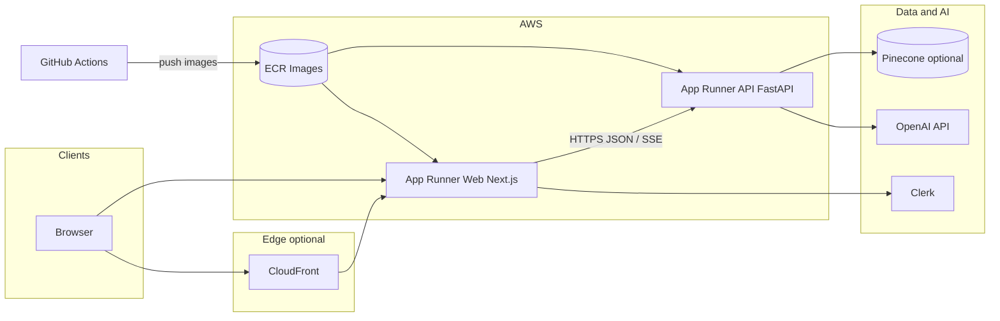
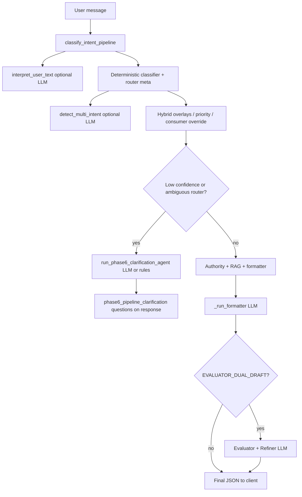

# NyayaSetu — Technical architecture & implementation reference

This document describes **product positioning**, **problem framing**, **system and data flows**, and **implementation details** for **LLMs**, **agents**, **RAG**, **guardrails**, **AWS/infrastructure**, **CI/CD**, and related mechanics. It is grounded in the current codebase; line references drift over time—prefer the cited paths when debugging.

**Companion docs:** [USER_REQUEST_FLOW.md](USER_REQUEST_FLOW.md) · [DEPLOYMENT_AWS.md](DEPLOYMENT_AWS.md) · [infra/README.md](../infra/README.md) · [ENVIRONMENT.md](ENVIRONMENT.md) · [CUSTOM_DOMAIN_IN.md](CUSTOM_DOMAIN_IN.md) · [backend/docs/RAG_PINECONE_RUNBOOK.md](../backend/docs/RAG_PINECONE_RUNBOOK.md) · [backend/docs/GOLDEN_ROUTING.md](../backend/docs/GOLDEN_ROUTING.md)

---

## Table of contents

1. [Product description](#1-product-description)  
2. [Problems addressed](#2-problems-addressed)  
3. [High-level system architecture](#3-high-level-system-architecture)  
4. [End-to-end data flow](#4-end-to-end-data-flow)  
5. [Frontend (implementation summary)](#5-frontend-implementation-summary)  
6. [Backend API surface](#6-backend-api-surface)  
7. [LLM usage (where and how)](#7-llm-usage-where-and-how) — **§7.1–§7.4** (provider, call table, formatter contract, embeddings)  
8. [Agents & clarification pipelines](#8-agents--clarification-pipelines) — **§8.1–§8.4** (flow diagram, `generate_legal_response` order, Phase 6 rules, related modules)  
9. [RAG pipeline (strict retrieval)](#9-rag-pipeline-strict-retrieval) — **§9.1–§9.7** (env, Pinecone vs local branches, thresholds, downstream, ingest, logs)  
10. [Guardrails & safety layers](#10-guardrails--safety-layers) — **§10.1–§10.8** (crisis triage, emergency draft, authority gate, limits, HTTP gates, formatter/post-process)  
11. [Authority resolution & directory](#11-authority-resolution--directory) — **§11.1–§11.2**  
12. [Evaluators & optional dual draft](#12-evaluators--optional-dual-draft)  
13. [Case law research](#13-case-law-research-lawyer-oriented-path) — modes & factory  
14. [AWS deployment architecture](#14-aws-deployment-architecture)  
15. [Infrastructure as code (Terraform)](#15-infrastructure-as-code-terraform)  
16. [GitHub Actions workflows](#16-github-actions-workflows) — **§16.1** paths & secrets  
17. [Configuration knobs](#17-configuration-knobs-selected)  
18. [Operational limits & compliance](#18-operational-limits--compliance-posture)  

---

## 1. Product description

**NyayaSetu** is a **legal AI companion** oriented to **India**: users describe issues in **plain language** (English, Hindi Devanagari, or Roman Hindi where configured), optionally attach **PDF/text/images**, and receive:

- **Streaming progress** and **clarifying questions** when routing is uncertain  
- **Structured explanations**, **next steps**, and **print-oriented drafts** (letters/applications/complaints) aligned to **authority type** (police, consumer commission, etc.)  
- **Grounded references** where RAG applies, with **explicit labels** when retrieval is weak  
- **Educational disclaimers** — not a substitute for a qualified advocate  

**Deployment surfaces:** Next.js web app (`frontend/`), FastAPI backend (`backend/app/`), optional **Pinecone** vector RAG, **Clerk** auth, **Stripe**-oriented billing hooks (deployment-dependent).

---

## 2. Problems addressed

| Problem | NyayaSetu approach |
|--------|---------------------|
| Wrong forum / authority | Deterministic **classification + jurisdiction router + authority blocks**; clarification when confidence is low |
| Overconfident generic answers | **Strict RAG pipeline**, **confidence & grounding labels**, evaluator hooks |
| Crisis vs administrative confusion | **`crisis_triage_lock`** + dedicated companion payloads vs normal RAG path |
| Language / UX | **i18n** strings, **`response_language`**, streamed phases in `/generate-stream` |
| Trust in contacts | **Verified vs suggested** authority; avoid inventing numbers (enforced in prompts/post-process where applicable) |

---

## 3. High-level system architecture

**Typical production path:** users hit **CloudFront** (optional) or **web App Runner URL** → Next.js calls **API App Runner** → OpenAI / optional Pinecone / internal knowledge JSON.

---

## 4. End-to-end data flow

A condensed sequence (non-streaming and streaming converge on `generate_legal_response`):

1. **Client** (`LegalChat`, `frontend/services/api.ts`) sends `POST /api/v1/generate` or **`/generate-stream`** with `user_input`, profile fields, `response_language`, `client_mode`, `task_type`, optional `skip_clarification`.  
2. **Rate limiting** — `consume_request` may return **429** with structured `detail` (`generate_rate_limited`).  
3. **`generate_legal_response`** (`backend/app/services/ai_service.py`) runs the **classification → routing → authority → triage → RAG/companion → LLM formatter** pipeline.  
4. **Response** includes `document`, `explanation`, `next_steps`, authority metadata, RAG fields, optional **`document_evaluator`** / **`document_revised`**, usage snapshot headers.

**Detailed narrative:** [USER_REQUEST_FLOW.md](USER_REQUEST_FLOW.md) (includes a Mermaid diagram aligned with `generate.py` / `ai_service.py`).

---

## 5. Frontend implementation summary

| Concern | Implementation |
|---------|----------------|
| Chat UX | `frontend/components/LegalChat.tsx` — streaming SSE, clarification chips, structured points |
| API client | `frontend/services/api.ts` — `streamGenerateLegalResponse`, parsing SSE events (`phase`, `clarification`, `result`, `error`) |
| Presentation | `frontend/components/FormattedLetter.tsx` — segments letter for display; **`presentation="raw"`** for refiner output on chat page |
| Letter parsing | `frontend/lib/formalLetterParse.ts` — segments To/Subject/body; strips internal markers like `PRINT_FILL_*` from preamble |
| Optional profile | `frontend/app/chat/page.tsx` — letterhead fields + `letterProfileForApi` merged with Clerk fallbacks |
| Offline queue | `frontend/lib/offlineGenerateQueue.ts` — localStorage / optional IndexedDB retry |

---

## 6. Backend API surface

| Endpoint | Role |
|----------|------|
| `POST /generate` | Full JSON response (`GenerateResponse`) |
| `POST /generate-stream` | **SSE**: phased messages, optional early clarification, final JSON payload |
| `POST /ingest-document` | Extract text from uploads (PDF/image/text); feeds user’s next message |
| `GET /config` (public) | Feature flags, RAG mode, limits — drives marketing/config UI |
| Other v1 routes | Billing, chat history, feedback, etc. (see `backend/app/api/v1/`) |

**Core implementation:** `backend/app/api/v1/generate.py`, schemas in `generate_schemas.py`.

---

## 7. LLM usage (where and how)

This section lists **every production LLM surface** in the backend: library, **model ID**, **temperature**, **response shape**, and **what gets sent**.

### 7.1 Provider, SDK, default model

| Item | Implementation |
|------|----------------|
| **SDK** | Official Python `openai` package — `OpenAI(api_key=settings.openai_api_key)` |
| **Chat completions** | `client.chat.completions.create(...)` — primary pattern for structured + drafting |
| **Embeddings** | `client.embeddings.create(model=..., input=texts)` — see §9 |
| **Default chat model** | `settings.openai_model` → env **`OPENAI_MODEL`**, default **`gpt-4o-mini`** (`backend/app/config.py`) |

If **`OPENAI_API_KEY`** is missing, **`generate_legal_response`** fails early with a clear error; many optional layers (interpretation, Phase 6) degrade to **rules-only** or empty output instead of crashing.

### 7.2 Primary LLM table (call-by-call)

| # | Purpose | Module | API shape | Model | Temp | Notes |
|---|---------|--------|-----------|-------|------|-------|
| 1 | **Safe interpretation** (entities + paraphrase; **must not** assign legal category) | `backend/app/ai/llm_intent_engine.py` → `interpret_user_text` | `chat.completions`, **`response_format={"type":"json_object"}`** | `settings.openai_model` | **0.2** | User text truncated ~12k chars; deterministic classifier still owns routing |
| 2 | **Multi-intent split** (labour + criminal, etc.) | `backend/app/services/multi_intent.py` → `_llm_multi_intent` | JSON object | `settings.openai_model` | **0.1** | Merged with keyword heuristics |
| 3 | **Phase 6 intake questions** (routing-oriented) | `backend/app/services/clarification_agent.py` → `run_phase6_clarification_agent` | JSON `{"questions":[...]}` | `settings.openai_model` | **0.2** | Max 3 strings; **rule fallback** if no key or parse failure |
| 4 | **Structured / conversational clarification** | `backend/app/services/llm_clarification_agent.py`, `clarification_structured_llm.py`, `clarification_questions_llm.py` | JSON / chips | `settings.openai_model` | low (see each file) | Gated by routes / flags |
| 5 | **LLM fallback classification** (when deterministic router asks for help) | `backend/app/ai/llm_fallback_classifier.py`, `llm_issue_classifier.py` | JSON | `settings.openai_model` | low | Used when rules + meta indicate ambiguity |
| 6 | **Intent helpers** | `backend/app/ai/llm_intent_engine.py` (`classify_intent_pipeline`) | Combines deterministic `classify_legal_issue` + interpretation merge | — | — | Interpretation **does not** override categories |
| 7 | **Document formatter** — **main user-visible draft** | `backend/app/services/ai_service.py` → **`_run_formatter`** | **`response_format={"type":"json_object"}`** | `settings.openai_model` | **0.35** | System prompt = **`FORMATTER_SYSTEM_PROMPT`** + language / task-type / strict add-ons; user message bundles JSON blocks (classification, companion/RAG, authority, links). Parsed with **`json.loads`** — must return keys **`document`**, **`explanation`**, **`next_steps`**. |
| 8 | **Draft evaluator** (optional second pass) | `backend/app/ai/draft_evaluator_agent.py` → `run_evaluator_llm_normalized` | JSON scores + lists | caller `model` (=`settings.openai_model` from `ai_service`) | **0.15** | User payload includes `PRIMARY_FORUM`, `ISSUE_CATEGORY`, truncated user + draft |
| 9 | **Draft refiner** (optional third pass) | same → `run_refiner_llm` | JSON `document_revised`, `refiner_notes` | same | **0.25** | **`REFINER_SYSTEM`** enforces forum lock vs consumer↔police drift |
| 10 | **Vision OCR** (when enabled) | `backend/app/services/document_ocr.py` | `chat.completions` with image | **`settings.ingest_ocr_openai_model`** (default **`gpt-4o-mini`**) | — | Extract text from rasterized PDF pages / images |
| 11 | **Speech → text** | `backend/app/api/v1/transcribe.py` | Whisper API via OpenAI client | Whisper model path in route | — | User audio → transcript for chat paste |

**Shared JSON helper:** `draft_evaluator_agent._call_json` sets **`max_tokens=2048`** for evaluator/refiner rounds.

### 7.3 Formatter prompt contract (high level)

The formatter system prompt (**`FORMATTER_SYSTEM_PROMPT`** in `ai_service.py`) is large and **mandatory-reading** for anyone changing output shape. In short it enforces:

- **AUTHORITY_LOCK** — deterministic `AUTHORITY_BLOCK_JSON` / router JSON wins over LLM “creativity”.  
- **LEGAL_COMPANION_JSON** — statute detail must come from **`retrieved_laws`** chunks; no invented Acts/sections.  
- **PRINT_FILL_HEADER / FOOTER** — handwritten fill blocks; internal markers (e.g. `PRINT_FILL_*`) may be stripped in UI (`formalLetterParse`).  
- **Single JSON object** from the model → three top-level strings as above.

### 7.4 Embeddings (RAG-specific)

Defined in **`backend/app/ai/text_embeddings.py`**:

- **Model:** **`text-embedding-3-small`** (constant `EMBEDDING_MODEL`).  
- **Function:** `embed_texts(texts: list[str])` — batches for local cosine path and Pinecone query/upsert.  
- Returns **empty list** if no API key or SDK error (callers fall back to keyword scoring where implemented).

---

## 8. Agents & clarification pipelines

In this codebase, **“agents” are not autonomous agents with tools**. They are **deterministic pipelines** that occasionally call an LLM for **bounded JSON outputs** (questions, interpretation, multi-intent, classification fallback, formatter, evaluator).

### 8.1 Mental model

### 8.2 Orchestration entry: `generate_legal_response`

File: **`backend/app/services/ai_service.py`**.

Rough order (simplified):

1. **Normalize** `task_type`, load **user_details** / city.  
2. **`classify_intent_pipeline`** — combines **deterministic** classification with **`interpret_user_text`** (optional LLM) for entities/context only.  
3. **`detect_multi_intent`** — heuristics + optional **`_llm_multi_intent`**.  
4. **Routing overlays:** `_maybe_override_for_multi_intent`, **`apply_hybrid_civil_criminal_overlay`**, **`apply_priority_override`**, **`apply_law_and_order_land_hybrid_merge`**, **`apply_consumer_complaint_routing_override`**.  
5. **`classify_issue_enriched`** → **`issue_profile`**.  
6. **`maybe_attach_pipeline_clarification_questions`** (`clarification_agent.py`) — see §8.3.  
7. Authority: **`route_jurisdictions`**, **`resolve_verified_authority`**, **`build_unified_authority_block`**.  
8. **`crisis_triage_lock`** — if true, **`build_crisis_triage_companion_payload`** (abbreviated legal companion); **else** **`run_strict_rag_pipeline`** + **`build_legal_companion_payload`**.  
9. Assemble large **user_message** string for formatter (classification, companion JSON, authority, official links).  
10. **`_run_formatter`** → **`document` / explanation / next_steps**.  
11. If **`evaluator_dual_draft_enabled`**, **`run_evaluator_llm_normalized`** + **`run_refiner_llm`** (best-effort).

### 8.3 Phase 6 clarification agent (detailed)

**Function:** `maybe_attach_pipeline_clarification_questions` + `run_phase6_clarification_agent` — **`backend/app/services/clarification_agent.py`**.

| Rule | Value |
|------|--------|
| **Trigger** | `confidence < 0.90` **OR** `router_intent` in `general_issue` / `unknown` **OR** `needs_llm_fallback` |
| **Cap** | `clarification_round >= settings.clarification_max_rounds` → stop attaching (default **8** rounds via **`CLARIFICATION_MAX_ROUNDS`**) |
| **LLM system rules** | Max **3** questions; focus danger, ownership, timeline; **strict JSON** `{"questions":[...]}` |
| **Fallback** | **`_rule_fallback_questions`** — regex on land/violence keywords + generic timeline question |
| **User message to LLM** | Up to **8000** chars |

**Streaming / early exit:** When the HTTP layer chooses early clarification, the client may receive **`clarification`** SSE events before the full formatter runs — see **`generate.py`** stream handler and flags like **`skip_clarification`**.

### 8.4 Related modules (non-LLM but “agent-shaped”)

| Module | Role |
|--------|------|
| **`clarification_followup.py`** | Injects hints from free-text follow-up (“peaceful”, “lost property”) into classification. |
| **`hybrid_case_routing.py`** | Civil/criminal and land + law-and-order merges. |
| **`legal_priority_engine.py`** | Priority overrides when multiple facets compete. |

---

## 9. RAG pipeline (strict retrieval)

**Single entry:** **`run_strict_rag_pipeline`** — `backend/app/ai/rag_pipeline.py`.  
Called from **`generate_legal_response`** after authority resolution and **only when not in crisis triage lock** — see companion built at ~`rag_result = run_strict_rag_pipeline(...)` in `ai_service.py`.

### 9.1 Configuration (`backend/app/config.py`)

| Env / setting | Meaning |
|---------------|---------|
| **`RAG_VECTOR_STORE`** / `rag_vector_store` | **`local`** (default) or **`pinecone`** |
| **`PINECONE_API_KEY`**, **`PINECONE_INDEX`**, **`PINECONE_NAMESPACE`** | Server index; namespace may be empty |
| **`PINECONE_QUERY_CANDIDATES`** | Default **48**, clamped **[8, 200]** — Pinecone **pre-fetch** before issue-type filter |
| **`PINECONE_QUERY_CANDIDATES_LAWYER`** | Optional larger pre-fetch for **lawyer** mode |
| **`RAG_TOP_K_CITIZEN`** (alias **`RAG_TOP_K_DEFAULT`**) | Default **8** — final chunks after ranking |
| **`RAG_TOP_K_LAWYER`** | Default **12** |

**Caller:** `_rag_top_k_for_client_mode(client_mode)` selects citizen vs lawyer **top_k**.

### 9.2 Branch A: Pinecone path

When **`rag_vector_store == "pinecone"`**:

1. **`pinecone_rag_scored`** (`backend/app/rag/pinecone_legal_index.py`) runs.  
2. **Query embedding:** `embed_texts([query])` — **`text-embedding-3-small`**. If embedding fails → pipeline falls back to local JSON path (`pine_ok = False`).  
3. **`index.query(vector=..., top_k=n_fetch, namespace=..., filter=...)`** — `n_fetch = min(200, max(8, max_candidates))` where `max_candidates` comes from **`settings.pinecone_query_fetch_size(client_mode)`** (ties to citizen vs lawyer candidate counts).  
4. **Metadata filter** from **`_build_pinecone_filter(metadata_hints)`** — optional **`act_id`** and **`source_year`** equality.  
5. Matches deduped by entry key; **`metadata_to_entry`** maps Pinecone metadata to the same **dict shape** as local KB. Rows with **`verified: false`** in metadata are **skipped**.  
6. **`filter_entries_by_issue_type`** reduces to **`issue_type`** from taxonomy.  
7. Scores are **Pinecone similarity** (preserved per match).  
8. Returns **`(scored_tuples, pool_size, embedding_used, True)`** if index path succeeds.

If anything throws or returns empty — **warning log** and **fallback to Branch B**.

### 9.3 Branch B: Local curated JSON path

When Pinecone is not configured, fails, or returned no usable rows:

1. **`load_knowledge_entries()`** loads the in-repo curated store.  
2. **`filter_entries_by_issue_type(raw, issue_type)`** — domain relevance.  
3. If pool empty → immediate **`grounding_label: no_match`**, confidence **0**.  
4. **Scoring:**  
   - If **`openai_api_key`** set: embed **`[query] + [each content]`**, cosine similarity with **\[0,1\] mapping** `((cos+1)/2)` on each chunk.  
   - Else: **`_keyword_relevance_score`** — token overlap, **capped at `_KEYWORD_SCORE_CAP` = 0.72**.  
5. Sort **descending**, take **top_k** (from caller — citizen 8 / lawyer 12 by default).

### 9.4 Output structure and thresholds

Constants in **`rag_pipeline.py`**:

| Constant | Value | Role |
|----------|-------|------|
| **`VERIFIED_RETRIEVAL_THRESHOLD`** | **0.75** | Chunk marked **`verified: true`** only if score ≥ this **and** URL allowed by **`is_allowed_legal_source_url`** |
| **`_KEYWORD_SCORE_CAP`** | **0.72** | Max score for keyword path (keeps embedding path preferred when available) |
| **RAG confidence** | `max(retrieval_score)` over returned chunks | Drives **`confidence_score`** in API |
| **`rag_retrieved` label** | Requires **`embedding_used` AND confidence ≥ 0.45** | Strongest grounding |
| **`general_not_case_specific`** | Otherwise non-empty retrieval | Weak / keyword-heavy |
| **`no_match`** | No chunks after filtering | Companion text must not invent statutes |

Each hit is a **`RetrievedLawOut`**: `law`, `section`, `chunk`, `source_url`, `retrieval_score`, **`verified`**.

### 9.5 Downstream use

**`build_legal_companion_payload`** (`legal_reasoning_engine.py`) turns **`RagPipelineOut`** into **`legal_explanation`**, **`procedure_steps`**, **`retrieved_laws`**, **`rag_grounding_label`**, disclaimers — and the **formatter system prompt** requires the LLM to **only** expand statutes from those chunks.

### 9.6 Ingest / index operations (ops, not request path)

- **`upsert_knowledge_entries`**, **`upsert_curated_knowledge_from_file`** — embed with **`text-embedding-3-small`**, push to Pinecone with **`entry_to_metadata`**.  
- Runbook: [RAG_PINECONE_RUNBOOK.md](../backend/docs/RAG_PINECONE_RUNBOOK.md).

### 9.7 Observability

**`_log_rag_observability`** emits **structured JSON** with `query_hash` (SHA-256 prefix, not raw query), scores, **`grounding_label`**, **`client_mode`**, **`task_type`**, optional **`pinecone_fetch`**.

---

## 10. Guardrails & safety layers

Guardrails span **deterministic rules** (regex, classifier meta), **prompt constraints** (formatter / refiner), **infrastructure** (CORS, rate limits), and **post-processing** (document cleanup). They apply in **`generate_legal_response`** and **`generate.py`**.

### 10.1 Crisis triage (`crisis_triage_lock`)

**Module:** `backend/app/services/crisis_triage.py` — **`crisis_triage_lock(classifier_meta, taxonomy_ui, user_input=...)`** → **`True`** switches to **crisis companion** (short, action-first; **no full RAG companion** branch in `ai_service`).

**Approximate evaluation order:**

| Step | Condition | Effect |
|------|-----------|--------|
| 1 | **`alleges_arson_or_fire_at_police_station`** | Lock **True** |
| 2 | **`is_police_complaint_followup_escalation`** (prior complaint + inaction/delay + police context) **and not** hard emergency regex | Lock **False** unless `fine_intent` / `sub_type` ∈ sexual_offence, missing_person, attempt_to_murder |
| 3 | **`parse_followup_signals`** → peaceful / no force **and** no hard emergency | Lock **False** |
| 4 | **`classifier_meta.is_emergency`** | Lock **True** |
| 5 | Serious **`fine_intent`** / **`sub_type`** lists (sexual_offence, missing_person, attempt_to_murder, assault, arson, …) | Lock **True** |
| 6 | **`phase6_priority == law_and_order`** + **`severity == high`**, or **`women_child`** + high, or assault + high | Lock **True** |
| 7 | **Hybrid** + **`phase6_priority == law_and_order`** | Lock **True** |

**`is_police_complaint_followup_escalation`** detects “complaint filed” + “no action/delay” + police/FIR wording; excludes ongoing sexual/violence strings.

### 10.2 Companion payload: crisis vs normal

**True:** **`build_crisis_triage_companion_payload`** — skips **`run_strict_rag_pipeline`**.  
**False:** **`run_strict_rag_pipeline`** → **`build_legal_companion_payload`** with **`retrieved_laws`** / **`rag_grounding_label`**.

### 10.3 Emergency template path

**`generation_mode == "EMERGENCY_WITH_DRAFT"`** → **`use_emergency_template`** — localized emergency drafting, **`is_emergency`** flags; links may be cleared under crisis. **`_followup_escalation`** drives **`POLICE_FOLLOWUP_INACTION`** formatter add-ons for oversight vs fresh-FIR-only tone.

### 10.4 Authority verification gate

**`evaluate_strict_authority_gate`** (`backend/app/ai/authority_evaluator.py`): requires **`VERIFIED`** status, **`trust_score >= VERIFIED_AUTHORITY_MIN_SCORE`**, **`source_label == verified_authority`** when set, and **district match** for external resolution. **`authority_pipeline.py`** applies this in **`resolve_verified_authority`**.

### 10.5 Rate limits

**`consume_request`** (`usage_limit.py`): UTC **daily** counter; **Redis** keys `nyaya:daily:{date}:user:{id}` / `anon:{ip}` or in-memory **`DailyLimiter`**. **`http_rate_limit_headers`** → **`X-RateLimit-*`**. Caps: **`daily_limit_anonymous`**, authenticated, trial, pro — see **`effective_daily_limit_for_user`**. [RATE_LIMIT_REDIS.md](../backend/docs/RATE_LIMIT_REDIS.md).

### 10.6 HTTP / API gates (`generate.py`)

**`_resolve_client_mode`** (body vs **`X-Client-Mode`**), **`_ensure_lawyer_mode_allowed`**, **`_coalesce_response_language`**, **`_error_code_for_value_error`** (OpenAI missing key vs 401 vs generic).

### 10.7 Formatter add-ons

**`language_addon`**, **`task_type_addon`**, **`strict_addon`** — explicit TASK_TYPE / consumer / police-followup hints to reduce wrong-forum drafts.

### 10.8 Document post-processing

**`_postprocess_document`**: sanitize police-station lines, strip markdown, **`_strip_police_only_contact_line_for_non_police`**, **`_append_bottom_party_block`**. Applied to **`document_revised`** when present.

### 10.9 Cross-cutting

**CORS:** **`CORS_ORIGINS`**, **`CORS_ALLOW_APPRUNNER_REGEX`**. **URL allowlist:** **`is_allowed_legal_source_url`**. **Refiner:** **`REFINER_SYSTEM`** (§12).

---

## 11. Authority resolution & directory

### 11.1 Resolution pipeline

1. **`route_jurisdictions`** — primary/secondary/fallback/steps.  
2. **`resolve_verified_authority`** — directory + **`evaluate_strict_authority_gate`**.  
3. **`build_unified_authority_block`** — single JSON for API (**verified / suggested / unknown**).

### 11.2 Client contract

**`generate_mappers.py`** maps to **`authority`**, **`trust_report`**, **`authority_summary`** for the UI.

---

## 12. Evaluators & optional dual draft

**`EVALUATOR_DUAL_DRAFT`** → **`run_evaluator_llm_normalized`** + **`run_refiner_llm`** (see §7.2). Errors swallowed; primary **`document`** still returned.

**Skipped when** **`use_emergency_template`** is True — no extra LLM cost on emergency path.

---

## 13. Case law research (lawyer-oriented path)

**`search_case_law_references`** — `backend/app/research/case_law/factory.py`.

| `CASE_LAW_MODE` | Implementation |
|-----------------|----------------|
| **`off`** | Returns **`[]`** |
| **`noop`** | **`NoopCaseLawSource`** |
| **`tavily_preview`** | **`TavilyPreviewCaseLawSource`** + **`TAVILY_API_KEY`** |

Only **`client_mode == lawyer`** gets results; **`CASE_LAW_MAX_RESULTS`** clamps **1–10**. Treat snippets as non-authoritative.

---

## 14. AWS deployment architecture

| Component | Service | Notes |
|-----------|---------|-------|
| Registry | **ECR** | **`nyayasetu-api`**, **`nyayasetu-web`** |
| API | **App Runner** | **`nyayasetu-api:latest`**, port **8000**, **`GET /health`** |
| Web | **App Runner** | **`nyayasetu-web:latest`**, port **3000** |
| CDN | **CloudFront** | Origin = web App Runner; optional aliases + ACM |
| DNS/TLS | **Route 53 + ACM (us-east-1)** | [CUSTOM_DOMAIN_IN.md](CUSTOM_DOMAIN_IN.md) |
| CI identity | **IAM OIDC** | **`nyayasetu-github-deploy`** |

Not on the default request path: Lambda, API Gateway. **Postgres** optional for entitlements — [ENTITLEMENTS_POSTGRES.md](../backend/docs/ENTITLEMENTS_POSTGRES.md).

---

## 15. Infrastructure as code (Terraform)

**Root:** `infra/terraform/nyayasetu/` — ECR, IAM (OIDC + App Runner pull), dual App Runner services, optional CloudFront / Route 53 / ACM.

**Bootstrap:** `scripts/deploy-aws.sh` + **`backend.s3.hcl`** remote state.

**Outputs:** `api_public_url`, `web_cloudfront_url`, **`github_deploy_role_arn`**, **`effective_web_app_public_url`** (custom domain).

---

## 16. GitHub Actions workflows

| Workflow | File | Behaviour |
|----------|------|-------------|
| **CI** | `.github/workflows/ci.yml` | Forbidden-secret scan, **`pytest`**, **`tsc`**, **`npm run lint`**, **`npm run build`** |
| **Deploy AWS** | `.github/workflows/deploy-aws.yml` | **`main`** + path filters **or** **`workflow_dispatch`** → OIDC → build/push **both** images → ECR `:latest` |
| **Destroy** | `destroy-aws-terraform.yml` | Manual only |
| **Routing golden** | `routing-golden-weekly.yml` | Scheduled routing pytest slice |

### 16.1 Deploy inputs

**Secrets:** **`AWS_ROLE_TO_ASSUME`**, **`NEXT_PUBLIC_API_URL`**. **Variable:** **`WEB_APP_PUBLIC_URL`** → **`NEXT_PUBLIC_APP_URL`** bake. Details: [infra/README.md](../infra/README.md).

---

## 17. Configuration knobs (selected)

| Area | Env / setting | Purpose |
|------|----------------|---------|
| LLM | `OPENAI_API_KEY`, `OPENAI_MODEL` | Chat + JSON outputs |
| Embeddings | Fixed **`text-embedding-3-small`** in code | RAG vectors |
| RAG | `RAG_VECTOR_STORE`, `PINECONE_*`, `RAG_TOP_K_*` | Store + window |
| Dual draft | `EVALUATOR_DUAL_DRAFT` | Evaluator + refiner |
| Clarification | `CLARIFICATION_MAX_ROUNDS` | Phase 6 cap |
| Case law | `CASE_LAW_MODE`, `CASE_LAW_MAX_RESULTS`, `TAVILY_API_KEY` | Lawyer research |
| Limits | `DAILY_LIMIT_*`, `TRIAL_PERIOD_DAYS`, `REDIS_URL` | Caps + shared counters |
| CORS | `CORS_ORIGINS`, `CORS_ALLOW_APPRUNNER_REGEX` | Browser API |
| Billing | `BILLING_MODE`, Stripe secrets | Checkout |
| OCR | `INGEST_OCR_PROVIDER`, `INGEST_OCR_OPENAI_MODEL` | Ingest |

[ENVIRONMENT.md](ENVIRONMENT.md), `backend/.env.example`, `frontend/.env.example`.

---

## 18. Operational limits & compliance posture

- **Disclaimers** — **`LEGAL_EDUCATION_DISCLAIMER`**, **`CRISIS_MODE_LEGAL_MESSAGE`**, **`i18n_response_strings.py`**; formatter forbids invented contacts.  
- **Grounding** — **`rag_grounding_label`** + **`NO_RAG_MATCH_MESSAGE`** when retrieval is weak.  
- **Usage** — Response **`usage`** + **`X-RateLimit-*`** headers.  
- **Lawyer mode** — Optional gates; case law marked informational.  
- **Tests** — **`backend/tests/`**, [GOLDEN_ROUTING.md](../backend/docs/GOLDEN_ROUTING.md).

---

## Appendix A — Key source files (quick index)

| Concern | Path |
|---------|------|
| Orchestration | `backend/app/services/ai_service.py` |
| HTTP + limits | `backend/app/api/v1/generate.py` |
| Usage limits | `backend/app/services/usage_limit.py` |
| RAG | `backend/app/ai/rag_pipeline.py`, `backend/app/rag/pinecone_legal_index.py` |
| Crisis triage | `backend/app/services/crisis_triage.py` |
| Authority gate | `backend/app/ai/authority_evaluator.py`, `authority_pipeline.py` |
| Draft evaluator | `backend/app/ai/draft_evaluator_agent.py` |
| Clarification | `backend/app/services/clarification_agent.py` |
| Case law | `backend/app/research/case_law/factory.py` |
| Terraform | `infra/terraform/nyayasetu/*.tf` |
| Deploy | `.github/workflows/deploy-aws.yml` |

---

*Document generated for engineering handoff and demos; update alongside major pipeline changes.*
