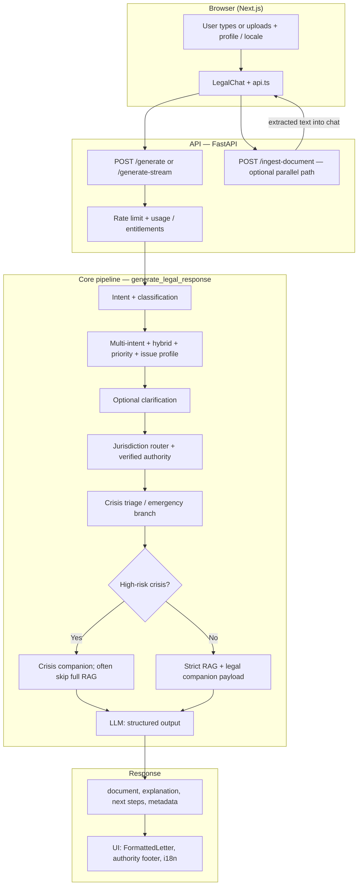

# User issue → response flow (NyayaSetu)

This document describes how a user’s text (and optional documents) moves through the **web client**, **API**, **classification and safety layers**, and **LLM output** to produce the legal-style answer shown in the UI. It is aligned with the current backend (notably `app/api/v1/generate.py`, `app/services/ai_service.py`, and related services).

**Related:** [GOLDEN_ROUTING.md](../backend/docs/GOLDEN_ROUTING.md) (tests and regression surfaces) · [ENVIRONMENT.md](ENVIRONMENT.md) · [USER_PERSONAS.md](USER_PERSONAS.md) (citizen vs lawyer goals and disclaimers) · [CORPUS_V1_BOUNDARY.md](CORPUS_V1_BOUNDARY.md) (what may enter automated ingest v1) · [CLIENT_MODE_DESIGN.md](CLIENT_MODE_DESIGN.md) (optional `client_mode` / `X-Client-Mode` on generate)

---

## 1. High-level diagram

---

## 2. Client layer

| Step | What happens |
|------|----------------|
| **Input** | The user enters a **legal problem** in the chat, optionally after **uploading a document** (or using voice, which is transcribed and then sent as text). Profile fields (name, city, etc.) and **locale** (English / हिंदी / Romanized Hindi) travel with the request. |
| **Auth & limits** | If signed in, **Clerk** supplies identity; the API can apply **entitlements** and **daily usage** limits (see `consume_request` in the generate route). |
| **Transport** | `POST /api/.../generate` or **SSE** `POST /generate-stream` for phased updates; see `streamGenerateLegalResponse` and `frontend/services/api.ts`. |
| **Offline** | Optional **queue + retry** when the network fails (`offlineGenerateQueue`), separate from the core reasoning pipeline. |

---

## 3. API entry (generate)

1. **Rate / usage** — `consume_request` may return **429** with `generate_rate_limited` if the user exceeds limits.  
2. **Request body** — `user_input`, optional `skip_clarification`, `response_language` (e.g. `en`, `hi`, `hi_latn`), and profile for drafting.  
3. **Dispatch** — Non-streaming and streaming paths both call **`generate_legal_response`** in `app/services/ai_service.py` (stream wraps it with progress events).  

**Document path (separate but feeds the same chat):** `POST /ingest-document` runs extraction (and optional **OCR** for scans / images / empty-text PDFs when configured). The **extracted text** is shown or appended so the user’s *next* generate call can reference that content in `user_input` or context.

---

## 4. Classification and routing layers (before LLM “meat”)

These run inside **`generate_legal_response`** in order, building **`classifier_meta`**, **`taxonomy_ui`**, and **`issue_profile`**.

| Layer | Role (simplified) |
|--------|----------------------|
| **Intent pipeline** | `classify_intent_pipeline` — interpretation + **legal taxonomy** (issue type, severity, jurisdiction, domain). |
| **Multi-intent** | Splits or adjusts when the user’s message contains **several** legal threads. |
| **Hybrid civil/criminal overlay** | `apply_hybrid_civil_criminal_overlay` — nudges classification when the fact pattern is mixed. |
| **Priority** | `apply_priority_override` — e.g. law-and-order or urgency signals. |
| **Law & order + land** | `apply_law_and_order_land_hybrid_merge` — land disputes that also touch public order. |
| **Enriched issue** | `classify_issue_enriched` — richer `issue_profile` (category, severity, keywords, …) for the UI and downstream. |
| **Clarification (optional)** | If not skipped, the **clarification** path may return **clarifying questions** instead of a full draft (see `run_early_clarification` / pipeline agents) — the UI shows options or free-text follow-up. |
| **Jurisdiction router** | `route_jurisdictions` (via router result) — which **authorities** are **primary/secondary** and a human-readable routing story. |
| **Verified authority** | `resolve_verified_authority` + `build_unified_authority_block` — a **verifiable** office/helpline when the domain allows (with **strict** gates so, e.g., labour is not used for a criminal route incorrectly). |
| **LLM fallback logging** | If the classifier has to lean on the LLM for routing, a **structured log** is written for triage. |

---

## 5. Safety: crisis, emergency, hybrid

| Check | Effect |
|--------|--------|
| **Crisis triage** | `crisis_triage_lock` — for certain **high-risk** `law_and_order` + severity combinations, the pipeline **locks** into a **safety-first** path: it builds a **crisis companion** with `build_crisis_triage_companion_payload` and **does not** run the normal RAG “full legal letter” path in the same way. |
| **Normal path** | If **not** in that crisis lock, **`run_strict_rag_pipeline`** runs, then `build_legal_companion_payload` to inject **RAG** snippets and **authority** into the model context. |
| **Emergency with draft** | `generation_mode == "EMERGENCY_WITH_DRAFT"` (`use_emergency_template`) — a **templated** urgent draft (e.g. FIR / police / safety wording) in **EN/HI/hi_latn** with `render_emergency_fir_contextual`, short `explanation`, and fixed **next_steps**; **RAG/official links** are suppressed. |
| **Hybrid crisis instructions** | When the case is **hybrid** (civil + criminal) **and** crisis is active, extra **system** instructions tell the model to lead with **police** and avoid mixing a second **civil suit** in the same document body. |

**Trust (downstream of authority block):** `trust_score` / `trust_is_verified` feed the **document formatter** and UI labels. Evaluators in `app/evaluators` and the **legal verifier** can be applied when enabled.

---

## 6. RAG, companion JSON, and LLM generation

- **RAG (non-crisis or non–crisis-locked):** `run_strict_rag_pipeline` uses the active vector store (local or **Pinecone** per env) for **PII-safe** logging and **grounding** (see RAG runbooks in `backend/docs`).  
- **Payloads:** A large set of **JSON** blobs (`classification`, `jurisdiction_router`, `authority`, `companion` / crisis companion, RAG) is sent to the **output formatter** / LLM in one structured generation step (see the `---` delimited context around `f"---\nJURISDICTION_ROUTER_JSON:..."` in `ai_service.py`).  
- **Output format:** The model returns structured fields: **`document`** (main draft), **`explanation`**, **next steps**, and metadata used by the API response model.  
- **No emergency branch:** A general **LLM** path applies **hybrid** instructions and standard caps on steps/explanations; **land** and **emergency** detectors can further specialize behavior.

The **output formatter** (`app/services/output_formatter.py`) can shorten or reshape lists when **crisis** or **emergency** is true (fewer step bullets, shorter explanations).

---

## 7. API response and UI

| Output field | Typical use |
|--------------|-------------|
| `document` | Shown as the main **letter / application** in **FormattedLetter**; export to Word/print. |
| `explanation` | Short rationale or “precision” line. |
| `procedure_steps` / `next_steps` | **Next steps** list in the card. |
| `authority` / `legal_classification` | **Authority** strip, badges, and disclaimers. |
| `clarification_*` | If clarification ended the round, the UI **asks** questions before a full document. |
| `crisis_triage_mode` | Styling and messaging that this was a **safety-first** path. |
| `document_evaluator` / RAG **labels** (when present) | “Legal overview” / **grounding** line in the UI. |

**Streaming:** The **SSE** stream may emit `phase` events, then a final **JSON** payload with the same shape (or a clarification payload).

---

## 8. End-to-end (one paragraph)

The user’s issue is **captured** in the **Next** client with **locale and profile**; the **API** enforces **limits**, then classifies the issue through **intent, multi-intent, hybrid, and priority** layers, resolves **jurisdiction and verified authority** with **strict domain gates**, and applies **crisis and emergency** paths when warranted—sometimes **skipping** full **RAG** in favor of **safety-first** companions. Otherwise **strict RAG** and **companion** JSON **ground** the **LLM**, which **drafts** the `document` and **supporting** fields; the **output formatter** and **trust** settings adjust **length** and **labels** before the **UI** **renders** the answer with **i18n** and **Clerk**-gated **features** (e.g. billing, dashboard) where configured.

---

## 9. Pointers to code

| Concern | Primary locations |
|--------|---------------------|
| HTTP routes | `backend/app/api/v1/generate.py`, `ingest.py`, `transcribe.py` |
| Main orchestration | `backend/app/services/ai_service.py` — `generate_legal_response` |
| Classification | `app/ai/llm_intent_engine.py`, `app/core/legal_classifier.py`, priority/hybrid/land helpers under `app/services/` |
| Authority & router | `resolve_verified_authority`, `app/services/authority_*.py`, `app/ai/authority_*.py` (as wired from `ai_service`) |
| Crisis & emergency | `app/services/crisis_triage.py`, `emergency_*.py`, `build_crisis_triage_companion_payload` in `app/ai/legal_reasoning_engine.py` |
| RAG | `app/rag/`, `run_strict_rag_pipeline` |
| Phase 6 / agents / clarification | `app/services/phase6_agents.py`, `clarification_*.py` |
| UI | `frontend/components/LegalChat.tsx`, `page.tsx`, `services/api.ts` |

This is a **reference** map. For **exact** condition order, always check **`generate_legal_response`** in **`ai_service.py`**, which is the **single** orchestration point for a standard generate.
